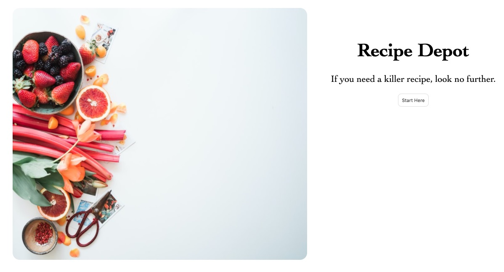

<h1 align="center">
  Recipe Center
</h1>

<p align="center">
  
</p>

## Table of Contents
* [About](#About)
* [Live Demo](#demo)
* [Built With](#built)
* [Quick Start](#quick)
* [What's Inside](#inside)
* [Contributing](#Contributing)
* [Future Updates](#future)
* [Show Your Support](#show)
* [Author](#Author)

## About

Recipe center is a simple one page app, currently built for desktops made for searching up your favourite recipes. It utilises the [Spoonacular API](https://spoonacular.com/food-api).

## Live Demo <span id="demo"></span>

Click [here](https://kerronking.github.io/recipe-center/) to see a live demo.

## Built With <span id="built"></span>

This page was built using the following technologies:
- React
- Gatsby
- CSS3
- ES6

## 🚀 Quick start <span id="quick"></span>

1. **Clone the repo.**

    Clone the repo using the following link:

    ```
    $ git clone https://github.com/KerronKing/recipe-center.git
    ```

2.  **Start developing.**

    Navigate into your the site’s directory and start it up.

    ```
    $ cd recipe-center/
    $ gatsby develop
    ```

3.  **Open the source code and start editing!**

    Your site is now running at `http://localhost:8000`!

    _Note: You'll also see a second link: _`http://localhost:8000/___graphql`_. This is a tool you can use to experiment with querying your data.

    Open the `my-default-starter` directory in your code editor of choice and edit `src/pages/index.js`. Save your changes and the browser will update in real time!

## 🧐 What's inside? <span id="inside"></span>

A quick look at the top-level files in this repo.

    .
    ├── node_modules
    ├── src
    ├── .gitignore
    ├── .prettierrc
    ├── gatsby-browser.js
    ├── gatsby-config.js
    ├── gatsby-node.js
    ├── gatsby-ssr.js
    ├── LICENSE
    ├── package-lock.json
    ├── package.json
    └── README.md

## Future Updates <span id="future"></span>

- Media queries to be added.
- Styling edits.
- Add Logo.

## Contributing

Contributions, issues and feature requests are welcome!

Feel free to check the [issues page](https://github.com/KerronKing/recipe-center/issues).

## Show your support <span id="show"></span>

Feel free to drop a :+1: to show your support. It'd be greatly appreciated it :pray:

## License 

Gatsby is licensed under the MIT [license](./LICENSE).

## Author

:bust_in_silhouette: Kerron King

* Github: [@KerronKing](https://github.com/KerronKing)
* Email: kerronk1989@gmail.com
* Linkedin: [Kerron King](linkedin.com/in/kerron-shawn-king)


